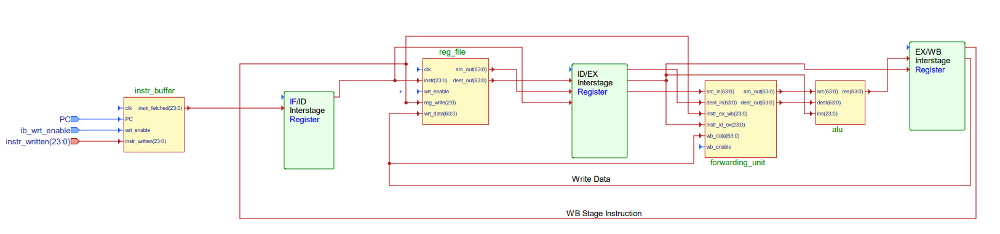

# Intel MMX Pipelined Processor and Assembler

The four-stage pipelined unit was designed in VHDL, and can execute much of the Intel MMX instruction set. This repo also contains an assembler for the instruction set written in C++, as well as example files showing a test run of the whole design.

## VHDL Design
The pipelined VHDL unit consists of four stages separated by interstage registers. The top-level structural design contains the following modules:

 - **Instruction buffer**: Holds up to 128 3-byte instructions to be executed in the pipeline. Program counter (PC) input determines which instruction to read, and a *wrt_enable* signal allows the buffer to be sequentially written.
 - **Register file**: Conatins the 8 64-bit registers MM0-MM7. Can be read combinationally and written sequentially similarly to the instruction buffer.
 - **Forwarding unit**: If an instruction reads a register that was written by the previous instruction, the most recent value will not yet be in the register file to be read. The forwarding unit determines if this is the case, and redirects the new value to the ALU input if necessary.
 - **Arithmetic and logic unit**: Reads two 64-bit data inputs and 1 instruction input, executes the appropriate instruction, and outputs the result.

## Instruction Set
The instructions implemented include 26 instructions from Intel's MMX extensions, plus one custom instruction. The instruction format shown below was desgined specifically for this project. A complete reference for the MMX architecture can be found here: [https://www.csie.ntu.edu.tw/~cyy/courses/assembly/docs/ch11_MMX.pdf](https://www.csie.ntu.edu.tw/~cyy/courses/assembly/docs/ch11_MMX.pdf)

### 3-Byte Instruction Format
| **23:17** Opcode | **16:9** Immediate Value | **8:6** Load Index |   **5:3** Source Register    | **2:0** Destination Register |
|------------------|--------------------------|--------------------|------------------------------|------------------------------|
### Instruction List
#### Load Immediate
| Syntax             | Description                                                          | Opcode  |
|--------------------|----------------------------------------------------------------------|---------|
| **pldi** imm8, idx, dest | Load 8-bit immediate *imm8* into the 8-bit field of register *dest* indexed by *idx* | 0000000 |
#### Data Movement
| Syntax | Description | Opcode  |
|--------|-------------|---------|
|   **movd** src, dest    |   Copies lower double-word of *src* to lower double-word of *dest*, and clears the upper double-word of *dest*          |    0000001     |
|   **movq** src, dest     |    Copies 64-bit value of *src* to *dest*         |     0000010    |
#### Boolean Logic
| Syntax | Description | Opcode  |
|--------|-------------|---------|
|   **pand** src, dest    |   Logical AND of two 64-bit values          |  0000011       |
|   **por** src, dest     |   Logical OR of two 64-bit values          |    0000100     |
|    **pandn** src, dest    |   Logical NAND of two 64-bit values          |   0000101      |
|    **pxor** src, dest    |   Logical XOR of two 64-bit values          |    0000110     |
#### Shifting
| Syntax | Description | Opcode  |
|--------|-------------|---------|
|   **psllw**  imm8, reg   |   Logical left shift 16-bit words in *reg* by amount specified in *imm8*          |   0000111      |
|   **pslld**  imm8, reg     |     Logical left shift 32-bit double-words in *reg* by amount specified in *imm8*        |   0001000      |
|   **psllq**  imm8, reg     |   Logical left shift value in *reg* by amount specified in *imm8*          |   0001001       |
|   **psrlw**  imm8, reg    |     Logical right shift 16-bit words in *reg* by amount specified in *imm8*        |   0001010       |
|   **psrld**  imm8, reg     |   Logical right shift 32-bit double-words in *reg* by amount specified in *imm8*          |   0001011      |
|   **psrlq**  imm8, reg     |     Logical right shift value in *reg* by amount specified in *imm8*        |   0001100       |
####  Arithmetic
| Syntax | Description | Opcode  |
|--------|-------------|---------|
|   **paddb** src, dest     |    Unsigned addition of bytes in registers *src* and *dest*         |   0001101      |
|   **paddsb** src, dest     |     Saturated addition of signed bytes in *src* and *dest*        |   0001110     |
|   **paddusb** src, dest     |    Saturated addition of unsigned bytes in *src* and *dest*         |    0001111     |
|   **paddw** src, dest     |     Unsigned addition of 16-bit words in registers *src* and *dest*        |  0010000       |
|   **paddsw** src, dest     |     Saturated addition of 16-bit signed words in *src* and *dest*        |   0010001      |
|   **paddusw** src, dest     |     Saturated addition of 16-bit unsigned words in *src* and *dest*        |    0010010     |
|   **paddd** src, dest     |    Unsigned addition of 32-bit double-words in registers *src* and *dest*         |    0010011     |
#### Data Packing
| Syntax | Description | Opcode  |
|--------|-------------|---------|
|   **packssdw** src, dest    |   Convert double-words to words by signed saturation       |    0010100     |
|   **packsswb** src, dest    |   Convert words to bytes by signed saturation       |    0010101     |
|   **packusdw** src, dest   |    Convert double-words to words by unsigned saturation      |    0010110     |
|   **packuswb** src, dest   |    Convert words to bytes by unsigned saturation      |    0010111     |
|   **punpcklbw** src, dest   |   Unpack the lower four bytes from *src* and *dest* and store them as interleaved bytes in *dest*.       |   0011000      |
|   **punpcklwd** src, dest   |    Unpack the lower two words from *src* and *dest* and store them as interleaved words in *dest*.      |   0011001      |
|   **punpckldq** src, dest   |    Unpack the bottom double-words of two registers and store them in *dest*.      |   0011010      |

## How to Run

 - The assembler is run from the command line, and accepts one argument for the input filename and optionally a second argument for the output filename (defaults to *assembler_output.bin*). 
 - The assembler isn't too robust so it only accepts specific syntax rules; these are described in *assembler.h* and shown in the example file *assembler_input.asm*.
 - The VHDL design can be simulated with presumably any simulator tool; I used Aldec Active HDL 11.1.
 - There are two VHDL testbenches to simulate: one that just tests the ALU and one that tests the entire design.
 - The ALU testbench just loads example values for every instruction and tests that the outputs are correct.
 - The main testbench looks for a file called *assembler_output.bin* to read instructions from, then executes the instructions. It also creates a results file that shows the status of the pipeline and the register file during each cycle, as shown in the example file in the *test* folder.